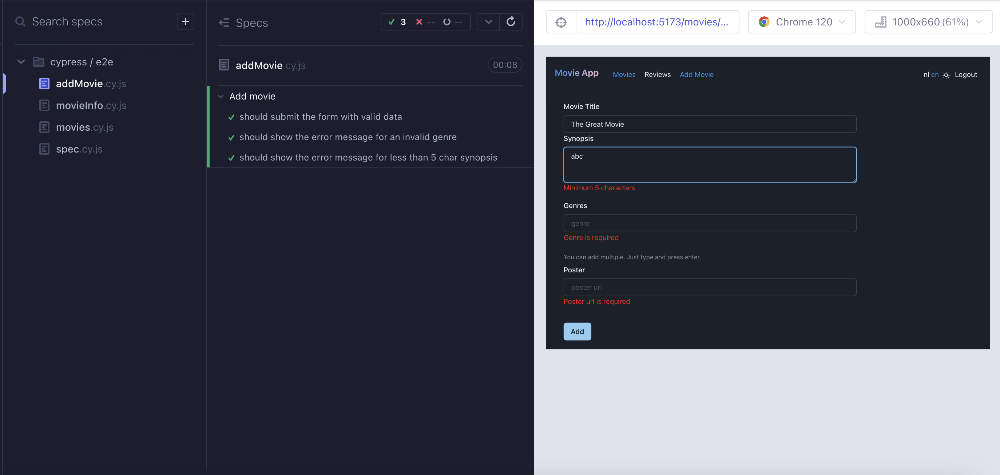

# Sujan Sapkota (202293706)

- [x] Front-end Web Development:
  - <https://github.com/Web-IV/2324-frontendweb-sujansapkota2>
  - <https://fwd-movie-app.onrender.com/>
- [x] Web Services:
  - <https://github.com/Web-IV/2324-webservices-sujansapkota2>
  - <https://be-movie-app-0bry.onrender.com>

**Logingegevens**

- admin gebruiker
  - Gebruikersnaam/e-mailadres: janadmin@gmail.com
  - Wachtwoord: verydifficult
- gewone gebruiker
  - Gebruikersnaam/e-mailadres: januser@gmail.com
  - Wachtwoord: verydifficult

## Projectbeschrijving

### Movie App

Dit project is een filmsysteem waarin gebruikers (alleen een gebruiker met rechten=admin) films kunnen toevoegen, recensies kunnen schrijven (elke gebruiker kan dit laatste).

Het systeem bevat entiteiten zoals gebruikers, gebruikerstypes, genres, films en recensies.

Gebruikers kunnen verschillende rollen hebben (gebruikerstypes: admin, user). Films kunnen meerdere geners hebben. En recensies zijn gekoppeld aan zowel gebruikers als films, dus dit wilt zeggen dat per film een gebruiker 1 recensie kan plaatsen.

Een gebruiker kan zijn recensie updaten, verwijderen en dan een nieuwe plaatsen.

(password is uiteraard password hash)

Nog meer uitleg hieronder met screenshots van de website er bij.

## Screenshots

### Film toevoegen door admin

Een admin gebruiker kan een film toevoegen.

### Elke gebruiker ziet lijst van alle films

### Gebruiker kan op een film klikken.

Dan ziet die volgende info over de film.

### Gebruiker kan op review klikken om die film te beoordelen

#### Gebruiker heeft nog geen review

In dit geval ziet de gebruiker een review form om een review te plaatsen

#### Gebruiker heeft al een review

Dan ziet gebruiker zijn review

beetje scrollen.... dan kan je review updaten of verwijderen

### Lijst van review

Gebruiker kan lijst van films zien die hij/zij al heeft beoordeelt.
(Zo zie je ook dat er light mode is, en dat website grootendeels vertaaald is)

### Responsive

Zo zie je ook dat website responsive is.

## API calls

### Gebruikers

- `GET /api/users`: alle gebruikers ophalen
- `GET /api/users/:id`: gebruiker met een bepaald id ophalen
- `GET  /api/users/:userId/movies/:movieId/review`: geef een reviews van een bepaalde gebruiker met userId voor een bepaalde movie met movieId (feature: als een gebruiker een review van een andere gebruiker wilt zien voor een bepaald movie met movie id)
- `POST /api/users/login`: logt de gebruiker in
- `POST /api/users/register`: regristeert de gebruiker

### Movies

- `GET /api/movies`: alle movies ophalen
- `GET /api/movies/:id`: movie met een bepaald id ophalen
- `GET /api/movies/genres`: alle genres die bij movies kunnen horen ophalen
- `GET /api/movies/:id/genres`: alle genres die bij een movie met bepaald id horen ophalen
- `GET /api/movies/:id/reviews`: alle reviews die bij een movie met bepaald id horen ophalen
- `GET /api/movies/:id/review`: haal review voor een movie met bepaald id
- `GET /api/movies/:id/rating`: haal rating voor een movie met bepaald id
- `POST /api/movies`: movie toevoegen
- `DELETE /api/movies/:id`: movie met een bepaald id verwijderen

### Reviews

- `GET /api/reviews`: alle reviews ophalen (voor ingelogd gebruiker)
- `GET /api/reviews/:id`: haal een review met een bepaald id
- `POST /api/reviews`: review toevoegen
- `PUT /api/reviews/:id`: review met een bepaald id updaten
- `DELETE /api/reviews/:id`:review met een bepaald id verwijderen

### Health

- `GET /api/health/ping`: return pong als server draait
- `GET /api/health/version`: return versie nr applicatie

## Behaalde minimumvereisten

### Front-end Web Development

- **componenten**

  - [x] heeft meerdere componenten - dom & slim (naast login/register)
  - [x] applicatie is voldoende complex
  - [x] definieert constanten (variabelen, functies en componenten) buiten de component
  - [x] minstens één form met meerdere velden met validatie (naast login/register)
  - [x] login systeem
         

- **routing**

  - [x] heeft minstens 2 pagina's (naast login/register)
  - [x] routes worden afgeschermd met authenticatie en autorisatie
         

- **state-management**

  - [x] meerdere API calls (naast login/register)
  - [x] degelijke foutmeldingen indien API-call faalt
  - [x] gebruikt useState enkel voor lokale state
  - [x] gebruikt gepast state management voor globale state - indien van toepassing
         

- **hooks**

  - [x] gebruikt de hooks op de juiste manier
         

- **varia**

  - [x] een aantal niet-triviale e2e testen
  - [x] minstens één extra technologie
  - [x] maakt gebruik van de laatste ES-features (async/await, object destructuring, spread operator...)
  - [x] duidelijke en volledige README.md
  - [x] volledig en tijdig ingediend dossier en voldoende commits

### Web Services

- **datalaag**

  - [x] voldoende complex (meer dan één tabel, 2 een-op-veel of veel-op-veel relaties)
  - [x] één module beheert de connectie + connectie wordt gesloten bij sluiten server
  - [x] heeft migraties - indien van toepassing
  - [x] heeft seeds
         

- **repositorylaag**

  - [x] definieert één repository per entiteit (niet voor tussentabellen) - indien van toepassing
  - [x] mapt OO-rijke data naar relationele tabellen en vice versa - indien van toepassing
         

- **servicelaag met een zekere complexiteit**

  - [x] bevat alle domeinlogica
  - [x] bevat geen SQL-queries of databank-gerelateerde code
         

- **REST-laag**

  - [x] meerdere routes met invoervalidatie
  - [x] degelijke foutboodschappen
  - [x] volgt de conventies van een RESTful API
  - [x] bevat geen domeinlogica
  - [x] geen API calls voor entiteiten die geen zin hebben zonder hun ouder (bvb tussentabellen)
  - [x] degelijke authorisatie/authenticatie op alle routes
         

- **algemeen**

  - [x] er is een minimum aan logging voorzien
  - [x] een aantal niet-triviale integratietesten (min. 1 controller >=80% coverage)
  - [x] minstens één extra technologie
  - [x] maakt gebruik van de laatste ES-features (async/await, object destructuring, spread operator...)
  - [x] duidelijke en volledige README.md
  - [x] volledig en tijdig ingediend dossier en voldoende commits

## Projectstructuur

### Front-end Web Development

#### Mappen structuur

- src/:
  - api/: code for api calls
  - components/: de verschillende componenten (zie hieronder)
  - contexts/: auth context, language context, (geen theme context, ik gebruik prisma theme hiervoor)
  - pages/: de verschillende paginas
  - data/: bevat mock data die ik in het begin heb gebruikt
  - translations/: bevat bestand met vertaling (Nederlands en Engels)
- cypress/: bevat alle testen
- .env file: bevat env var VITE_API_URL, url van de api

#### Pagina structuur

Applicatie zit op volgende manier in elkaar (verschillende pages)

- `/movies`: pagina met lijst van alle movies
- `/movies/add`: pagina die alleen admin ziet, waar movies kunnen toegevoegd worden
- `/movies/:id`: pagina waar user alle info over een movie kan zien, als de gebruiker degene is wie de film heeft geplaats kan die het hier verwijderen
- `/movies/:id/review`: pagina waar je review kunt plaatsen als je nog geen review hebt geplaats, maar als je al review hebt kan je die, zien, verwijderen
- `/movies/:id/review/edit`: pagina waar je review kunt updaten
- `/reviews`: pagina met lijst van alle reviews van de ingelogde gebruiker

#### Componenten

##### Memoized components

- Movie Componenten die memoized is: wordt gebruikt bij MovieList en ReviewList

- Detail Componeten die memoized is: wordt gebruikt bij MovieDetail en ReviewDetail

##### Component: HasAccess

Het gebruikt de useAuth hook om toegang te krijgen tot de huidige gebruikersinformatie, en als de gebruiker bestaat en de userTypeId gelijk is aan 1 (wat betekent dat het een admin is), worden children geretourneerd

##### Forums

Maken allebei gebruik van component LabelInput en TextAreaInput

- MovieForm: bevat speciaal component InputGenre die meerder genres kan verwerken, bij enter wordt 1 genre opgeslagen, dan kan gebruiker volgende genre ingeven
- ReviewFrom: maakt gebruik van slider component van chakra ui

#### States

- AuthContext houdt alles bij over of gebruiker is ingelogd of niet. JWT is expired is of niet, als het expired is wordt de gebruiker uitgelogd (als de gebruiker de website opnieuw bezoekt zal gebruiker niet 'jwt expired' zien maar is die uitgelogd)
- Language houdt bij welke taal de gebruiker heeft gekozen, slaat die op in localStorage (Maar de taal wordt niet in db opgeslagen)

### Web Services

#### Mappenstructuur

- src/:
  - rest/: end points
  - services/: de business logica
  - repository: bevat alles prisma(declaratieve manier om met databases te communiceren) gerelateerde code om uit db gegevens te halen/sturen (Bewust keuze gemaakt om repo laag te gebruiken terwijl ik ORM gebruik)
  - cors/: middelware functies, logging, auth, validation, error
- prisma/: bevat schema.prisma die gebruikt worden bij migration en seed.js die gebruikt wordt bij seeding (bij stukje extra technologie leg ik verder uit wat er hiermee gebeurt)
- \_\_test\_\_: bevat testen

- config/: Bevat configuratiebestanden voor production, development, test

- .env file: bevate env vars voor dev/production
- .env.test: bevat env vars voor te testen

#### koa middleware

Middleware in koa: ------cors------bodyparser-----validate---endpoints

## Extra technologie

### Front-end Web Development

#### CHAKRA UI

<https://www.npmjs.com/package/@chakra-ui/react>

Chakra UI is een React-componentenbibliotheek die het bouwen van toegankelijke en gebruiksvriendelijke gebruikersinterfaces in React-toepassingen versimpelt.
Het heeft heel veel componenten die je kunt gebruiken.
Chakra UI maakt gebruik van een op thema gebaseerd styling-systeem. Je kunt eenvoudig de stijl van je app aanpassen door het thema te configureren.
Het maken van light mode en darkmode is bv. heel makkelijk als je chakra ui gebruikt.

### Web Services

#### PRISMA

<https://www.npmjs.com/package/prisma>

Prisma is een ORM, dat werken met een db makkelijk maakt.
Als je prisma gebruikt moet je eerst prisma schema maken. (EERD omzetten naar prisma model).
Nadat je het Prisma-schema hebt gemaakt, voer je het `yarn prisma generate-commando` uit, wat de bijbehorende Prisma-client genereert op basis van het schema.
Met de gegenereerde Prisma-client kun je dan queries uitvoeren zonder handmatig SQL te schrijven.

Prisma maakt migrations en seeding ook heel makkelijk. Nadat je schema hebt, kan je gewoon, `yarn prisma migrate deploy` en `yarn prisma db seed` doen en er zal een db gemaakt en geseed worden. (In dev env kan je gewoon `yarn prisma migrate dev` doen en zal migration en seeding in 1 keer gedaan worden.)

## Testresultaten

### Front-end Web Development

#### Film info

- Movie proberen verwijderen als admin
- Een review niet zien als nog geen review is gemaakt
- Een review zien als review al is gemaakt
- BUG test: kon review van vorige gebruiker die was aangemeld zien voor een tijdje door een bug (cache niet gecleard), dus een test geschreven na het fixen om te zien of het echt werkt of niet.

#### Film toevoegen

- Een film proberen toevoegen.
- Een genre proberen toekennen die niet in db bestaat(=ongeldige genre).
- Een film proberen toevoegen zonder alle velden te invullen.

#### Movie lijst simple tests

- Kan je loading zien voor trage response
- Kan je error zien als api call faalt
- Kan je lijst van films zien

### Web Services

Ik heb ervoor gekozen om `/api/movies` endpoint te teste (100% coverage rest-serive-repo in totaal waren dit 42 testen)
Hierbij heb ik alles getest, van movie posten, alle movies opvragen, opvragen door id,...

- Een film proberen toevoegen terwij je geen admin gebruiker bent.

- Een flim proberen te verwijderen terwijl die niet door jouw is geplaats.

- Een lijst van recencies van een film opvragen.

- Wordt er error gegooid not found als movie met bepaald id niet bestaat.

## Gekende bugs

### Front-end Web Development

/

### Web Services

/
